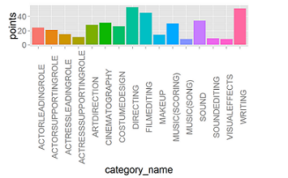
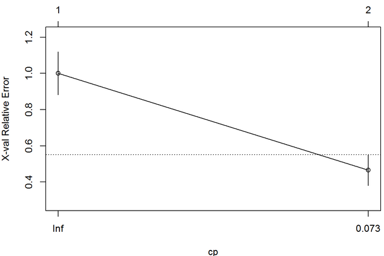
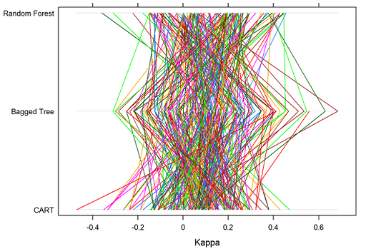

IS607 Project-3 Summary
========================================================
author: Is Best Film Editing is the best predictor of Best Picture ?

Analysis 1 - Points based approach
========================================================
[Refer Complete Analysis](https://rpubs.com/senthiltamil/Project3)

- *If Best Picture movie was also nominated on other categories then those categories get one point*
- *If the BEST Picture movie also won in other categories then those categories get two points. Categories with most points are the best indicators or predictors of Best picture movie.*

   
__Conclusion: Directing Category can be used a good indicator to PREDICT the BEST PICTURE.__

Analysis 2 - Using 'Bayes' formula
========================================================

[Refer Complete Analysis](http://rpubs.com/msekhar12/68495)

 - *Probability of getting Best Movie, given that the movie is nominated in a paricular award category ?*

Analysis 2 - Using 'Bayes' formula
========================================================

- *Probability of getting Best Movie, given that the movie wins in a paricular award category ?*

__Conclusion: Directing Category can be used a good indicator to PREDICT the BEST PRICTURE.__

Analysis 3 - Using 'Decision Tree'
========================================================

[Refer Complete Analysis](http://rpubs.com/jetherton/70678)

__Conclusion: Directing Category can be used a good indicator to PREDICT the BEST PRICTURE.__

Analysis 4 - Applying Modeling Techniques
========================================================

[Refer Complete Analysis Here](http://www.rpubs.com/dn11/70696).
*Different modeling techniques ( CART, Bagged Trees, Random Forests ) have been applied in the above analysis.*

__Conclusion: No definitive conclusion may be drawn here.__

========================================================
Overall Conclusion

- __Majority of our analysis concludes that the Best Film Editing is NOT the best predictor of Best Picture__
- __Also, most of the approaches suggests that the *Directing Category* can be used a good indicator to predict the *BEST PICTURE*.__

            
